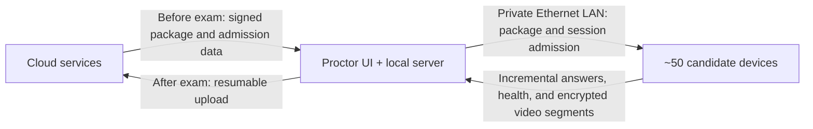

# Architecture

## Status and scope

This document records the approved target architecture for the PhilSLA Exam
Platform. Unless a section explicitly says **current**, it describes planned work,
not functionality present in the repository.

The system is intended for institution-managed Windows and macOS devices and an
exam cohort of approximately 50 candidate devices. It is offline-first during the
examination, while retaining a private gigabit Ethernet LAN between candidate
devices and the proctor machine.

### Current baseline

- .NET 10 MAUI Blazor Hybrid candidate application
- Windows and Mac Catalyst targets
- temporary local candidate authentication and readiness flow
- seeded four-block, single-choice examination workspace
- per-block timing, question navigation and flagging, explicit/timeout submission
- SQLite WAL attempt persistence with append-only, integrity-chained answer revisions
- Core examination rules separated from Candidate presentation and Infrastructure
  persistence
- .NET 10 MAUI Blazor Hybrid proctor workstation for Windows and Mac Catalyst
- seeded, offline manual attendance for assigned sessions: Present/Late check-in,
  absence review, corrections, durable SQLite WAL records, audit history, and
  audited finalization with read-only records

The current examination package, authorization delay, identity, and questions are
development fixtures. Mobile QR scanning, signed permits, a LAN attendance
endpoint, cross-process candidate admission, and cloud attendance synchronization
are not implemented. Encryption, package signing, recording, cloud services, and
production lockdown functionality are also not implemented.

Generated Android and iOS platform folders are present but are not project targets.

### Planned components

| Component | Responsibility | Status |
| --- | --- | --- |
| `PhilSLA.ExamPlatform.Candidate` | Candidate UI, local exam session, answer capture, recording orchestration, and proctor synchronization | Exam workspace vertical slice |
| `PhilSLA.ExamPlatform.Proctor` | Proctor-facing desktop UI and seeded offline manual attendance workflow | Workstation attendance vertical slice |
| `PhilSLA.ExamPlatform.Proctor.Server` | Local ASP.NET Core/Kestrel service used by candidates over the examination LAN | Planned |
| `PhilSLA.ExamPlatform.Core` | Domain rules and application use cases | Initial examination-session and attendance rules implemented |
| `PhilSLA.ExamPlatform.Contracts` | Versioned messages and data-transfer contracts shared across processes | Planned |
| `PhilSLA.ExamPlatform.Infrastructure` | SQLite, cryptography, networking, file storage, and platform adapter implementations | Initial SQLite exam-attempt and attendance stores implemented |
| `PhilSLA.ExamPlatform.SharedUi` | Reusable Blazor components and presentation primitives | Planned |
| Test projects | Unit, integration, contract, recovery, and performance tests | Domain, component, and SQLite recovery coverage started |
| Cloud API | Online identity, package distribution, and completed-exam ingestion | Deferred to a later design phase |

## Architectural style

The desktop applications use **Blazor component architecture, not classic MVVM**.
Razor components own presentation and interaction concerns, while injected
application services and scoped state coordinate use cases. Dependency injection
connects abstractions to infrastructure and native platform adapters.

MVVM is not the default application pattern. It should be introduced only if a
future native XAML screen has a concrete need for it; it must not create a parallel
application architecture for Razor screens.

The design is layered and modular:

1. Razor presentation calls application services and observes explicit UI/session
   state.
2. Core application services execute use cases and enforce domain rules.
3. Contracts define versioned boundaries between candidate, proctor, and eventually
   cloud processes.
4. Infrastructure implements persistence, transport, cryptography, and device
   integrations.
5. Platform adapters isolate Windows and macOS APIs behind application-owned
   interfaces.

### Dependency rules

- `Core` contains domain and application logic and must not depend on MAUI, Razor,
  SQLite, ASP.NET Core hosting, or platform-specific APIs.
- `Contracts` contains stable serialization contracts and must not depend on UI or
  infrastructure projects.
- Candidate, Proctor, and Proctor.Server may depend on `Core` and `Contracts`.
- `Infrastructure` may implement interfaces defined by `Core`; `Core` must not
  reference `Infrastructure`.
- `SharedUi` contains presentation-only reuse and must not become a home for domain
  rules or persistence logic.
- Windows Media Foundation/capture and macOS AVFoundation code remain in native
  adapters. Core code consumes platform-neutral recording interfaces.
- Cross-process communication uses contracts rather than sharing database models or
  internal domain entities.

## System and data flow

The expected lifecycle is:

1. While online, a candidate authenticates to the cloud with email and password,
   completes TOTP verification, and performs first-time setup and selfie capture
   when required.
2. The cloud issues a signed, time- and exam-scoped offline admission token. The
   proctor does not receive reusable plaintext passwords or a full copy of the cloud
   authentication database.
3. Before the examination, the proctor downloads and validates a signed, encrypted
   exam package and stages it on the proctor machine.
4. Internet access is disabled for the examination. The isolated private gigabit
   Ethernet LAN remains active.
5. Candidate devices discover or are configured with the local proctor endpoint,
   validate its identity, present offline admission, and obtain the authorized exam
   package/session.
6. Candidates save answers locally before acknowledging them in the UI, record
   webcam video locally, and transfer resumable updates and encrypted recording
   segments to the proctor during the exam.
7. The proctor retains a durable local copy, reports device and transfer health, and
   tolerates temporary candidate disconnections.
8. After the examination and restoration of internet access, the proctor performs a
   resumable, integrity-checked upload to the cloud.

The LAN service must not require public internet, DNS, or cloud availability during
the exam. Loss of the LAN must not prevent a candidate from continuing an already
admitted and downloaded examination; local persistence remains authoritative until
synchronization resumes.

## Technology stack

- .NET 10 LTS and C#
- .NET MAUI Blazor Hybrid for candidate and proctor desktop applications
- Razor components, injected application services/state, and built-in dependency
  injection
- ASP.NET Core with Kestrel for the local proctor service
- SQLite in WAL mode for local durable state
- Native Windows Media Foundation/capture APIs and macOS AVFoundation for webcam
  capture
- Hardware-accelerated H.264 encoding where supported
- Operating-system secure key stores for device-held encryption keys and secrets

Specific serialization, transport, discovery, database, and cryptographic formats
remain open decisions and require threat modeling plus performance testing.

## Local persistence and integrity

Candidate answers must be written locally and crash-safely. The planned persistence
model uses SQLite WAL with journaled answer revisions rather than destructive
in-place replacement. Each revision is associated with ordering metadata and
integrity hashes so recovery and synchronization can detect gaps or corruption.

Required properties:

- UI acknowledgement only after a durable local write
- idempotent synchronization and retry after disconnect or process restart
- recovery of the latest valid revision after power loss or crash
- explicit session and candidate scoping on every record
- encryption at rest with keys protected by the Windows or macOS secure key store
- bounded WAL/checkpoint behavior suitable for HDD-based candidate devices
- retention and secure cleanup rules defined before production use

Integrity hashes detect accidental damage; they are not a substitute for keyed
authentication or digital signatures where an adversary can modify both data and
hashes.

## Authentication and offline admission

Cloud authentication occurs before the examination and includes:

- email and password
- TOTP multi-factor authentication
- first-time account setup
- selfie capture under the institution's identity-verification policy

After successful online authentication and eligibility checks, the cloud signs an
offline admission token. It must be narrowly scoped to the candidate, device or
approved device binding, examination, allowed time window, and protocol version.
Candidate and proctor software validate signature, claims, expiry, and revocation
information available at package-staging time.

The local proctor system receives only the data needed to admit and supervise the
exam. It must not receive reusable plaintext passwords, TOTP seeds, or the full
cloud authentication database. Offline recovery, clock trust, token revocation,
device replacement, and emergency admission procedures remain to be designed.

## Webcam recording

Each candidate device records its webcam continuously for an examination lasting up
to four hours. Only webcam capture is in the approved scope; microphone capture is
not assumed.

The application uses native capture adapters:

- Windows: Media Foundation and applicable Windows capture APIs
- macOS: AVFoundation

Hardware H.264 encoding is preferred to control CPU load and storage use. Recordings
are split into encrypted segments, initially targeted at 5–10 minutes each. A
completed segment is authenticated, persisted locally, and queued for resumable
incremental transfer to the proctor. Segment identifiers and hashes allow both sides
to reconcile missing or corrupt data without retransmitting the full recording.

Recording must continue through temporary LAN outages. Disk pressure, camera
disconnect, permission loss, encoder failure, thermal throttling, suspend/resume,
and process recovery require explicit health states and proctor alerts. Codec
profiles, bitrate, resolution, frame rate, segment duration, and storage retention
must be established through representative-device testing.

## Device lockdown

Lockdown is an institution deployment responsibility as well as an application
feature. The app alone cannot guarantee a secure kiosk.

Planned controls include:

- Windows Assigned Access, AppLocker, Group Policy, and Shell Launcher where the
  installed Windows edition supports them
- macOS MDM Single App Mode and managed restrictions
- blocking or limiting app switching, clipboard operations, screenshots on a
  best-effort basis, external displays, and access to other applications
- policy verification and a visible readiness check before admission

Controls differ by operating-system version, edition, device management platform,
and hardware. The system must detect and report policy posture rather than claim
that an in-app restriction is tamper-proof. Windows 10 devices must use a supported
LTSC/ESU servicing path or migrate to Windows 11 for long-term security.

## Performance and reliability constraints

The target examination cohort is approximately 50 concurrent candidate devices on
a private gigabit Ethernet LAN.

Candidate minimum and recommended profile:

- 8th-generation Intel Core i3 class processor
- 8 GB RAM recommended
- HDD supported
- at least 10 GB free disk space before an exam

Proctor recommended profile:

- Intel Core i5 or AMD Ryzen 5 class processor or better
- 16 GB RAM or more
- 1 TB SSD
- wired gigabit Ethernet

The proctor service and transfer protocol must apply bounded concurrency and
backpressure so 50 video streams do not starve answer synchronization. Answer and
admission traffic has priority over recording transfer. Candidate workflows must
survive proctor restarts and network interruptions; the proctor must persist receipt
state before acknowledging uploads.

Before production, testing must cover:

- abrupt power loss and process termination during answer writes
- LAN loss, reconnect, packet loss, and proctor restart
- simultaneous reconnect and segment upload from approximately 50 devices
- four-hour recording duration on minimum candidate hardware
- HDD write latency, disk exhaustion, and SQLite WAL growth
- clock skew and offline token boundaries
- corrupted, duplicated, missing, and out-of-order messages or segments
- Windows and macOS lockdown/readiness behavior on supported managed-device builds

## Security boundaries

All exam packages, admission artifacts, answers, results, and recordings are
sensitive. Packages and cross-process messages require authenticated integrity;
confidential data requires encryption in transit and at rest. Keys must be separated
by purpose and environment, rotated according to policy, and never embedded in
source control.

TLS alone does not establish that a candidate is talking to the intended offline
proctor. The local trust/bootstrap and certificate lifecycle must be explicitly
designed. Similarly, encryption does not replace auditability: security-relevant
events require tamper-evident, privacy-conscious logs with clear retention rules.

Threat modeling, privacy review, consent requirements for selfie/video collection,
data residency, accessibility, and incident recovery are release prerequisites.

## Open decisions

- Exam package format, signature scheme, encryption envelope, and key distribution
- LAN service discovery and endpoint trust/bootstrap
- Candidate-to-proctor transport and message serialization
- Offline admission token format, trusted-clock policy, revocation, and emergency
  admission
- Device binding and replacement workflow
- Exact SQLite schema, revision model, checkpoint cadence, and database encryption
  implementation
- Video resolution, frame rate, bitrate, codec profile, and exact segment duration
- Transfer scheduling, backpressure limits, and storage-capacity calculations for
  50 four-hour recordings
- Proctor high-availability, backup, and recovery expectations
- Lockdown support matrix by Windows edition/version and macOS/MDM version
- Certificate issuance, rotation, revocation, and offline expiry handling
- Audit, retention, deletion, privacy, consent, and access-control policies
- Cloud API boundaries and the completed-exam ingestion protocol
- Packaging, signing, deployment, update, and rollback strategy for both platforms
- Observability and support workflow when the examination has no internet access
