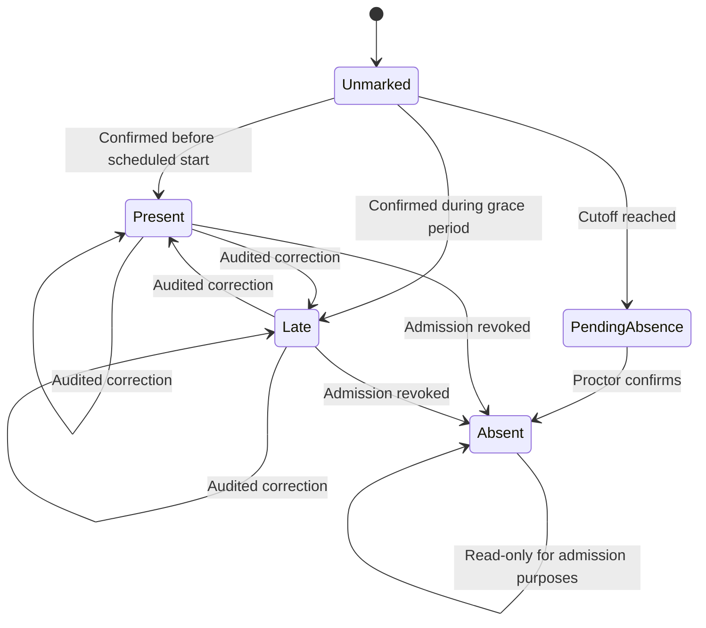

# Proctor Attendance Design

## Status

Approved storyline for a proctor-managed attendance workflow with session-specific
QR permits, an offline local network, and a mobile companion scanner. This design
covers attendance and its effect on admission. Schedule selection, rescheduling,
permit delivery, and post-session administrative correction are external workflows.

## Intent

Give an assigned proctor a reliable way to check students into one examination
session, classify them as Present, Late, or Absent, and use that attendance record
to control exam admission. The workflow must continue without public internet and
must not require a student to own a smartphone, printer, or candidate-side scanning
application.

The feature must remain understandable for students and proctors with limited
exposure to technology. A printed permit, a digital permit, and assisted manual
lookup are equally valid access paths.

## Operating assumptions

- Each examination session belongs to a room, schedule, assigned roster, and
  assigned proctor.
- A proctor may have several sequential schedules, but a mobile scanner is paired
  with only one active session at a time.
- Candidate computers communicate with the assigned proctor workstation over the
  private examination LAN.
- The proctor phone communicates with that workstation over local Wi-Fi on the same
  private network. Public internet is not required during check-in.
- If a room's examination LAN is wired-only, a secured access point provides the
  phone's local connection. A workstation-hosted hotspot is a contingency, not the
  normal deployment.
- The proctor workstation is the sole attendance authority. The mobile app is a
  scanning and confirmation interface, not an independent attendance store.

## Policies

The initial institution-level timing policy is:

- Check-in opens 30 minutes before the scheduled start.
- A confirmed check-in received before the scheduled start is Present.
- A confirmed check-in received at or after the scheduled start and before 15
  minutes after the start is Late.
- Check-in closes exactly 15 minutes after the scheduled start.
- At and after the cutoff, a new check-in is rejected.

For an 8:00 AM session, the windows are therefore:

| Workstation receipt time | Result |
| --- | --- |
| Before 7:30 AM | Check-in not open |
| 7:30:00 AM through 7:59:59 AM | Present |
| 8:00:00 AM through 8:14:59 AM | Late |
| 8:15:00 AM onward | Check-in closed |

The 30-minute opening window and 15-minute grace period are configurable by
administration for future sessions. A proctor cannot change them during an active
session.

Only Present and Late students may enter the exam. An Absent student cannot be
admitted to the scheduled session and must use the separate administrative
rescheduling process. Rescheduling creates a new session assignment and does not
rewrite the original Absent record.

## System responsibilities

### Web system

The web system assigns a student to a schedule and room, issues a unique
session-specific exam permit, and emails the permit after schedule selection. It
also prepares the offline session package consumed by the proctor workstation.

The permit QR contains opaque identifiers rather than unnecessary personal data.
It binds the student, examination session, room, validity window, unique credential
identifier, and issuer through a digital signature. A student may show the emailed
permit on a screen or print it.

### Proctor workstation

Before public internet is removed, the workstation downloads its assigned sessions,
rosters, reference photos, schedules, timing policies, permit-verification keys,
and other admission data required for offline operation.

The workstation:

- validates QR permits;
- owns the authoritative workstation clock used for attendance classification;
- applies check-in, cutoff, correction, and finalization rules;
- stores attendance and its audit history durably;
- controls candidate exam admission;
- exposes a secured local attendance endpoint to a paired mobile scanner; and
- synchronizes finalized records after internet access returns.

### Mobile scanner

The authenticated proctor authorizes pairing from the workstation. The mobile app
then pairs with that one workstation session, captures QR payloads, sends them to
the workstation, and displays workstation responses. Its active screen clearly
shows the examination, room, schedule, and assigned proctor.

It does not calculate Present or Late, independently finalize attendance, or accept
scans while disconnected. It does not queue scans for later submission.

### Candidate application

The candidate application requests admission from the assigned proctor workstation.
The workstation permits exam entry only when the student's authoritative attendance
record is Present or Late.

## Storyline

### 1. Permit issuance and session staging

1. The student chooses an available examination schedule in the web system.
2. The web system assigns the student to a specific session and room.
3. The web system emails a digitally signed, session-specific QR permit.
4. The student retains the permit digitally or prints it.
5. Before going offline, the proctor workstation downloads the final offline
   session package and verifies that its clock is trustworthy.
6. The proctor opens an assigned session and pairs one authorized mobile scanner.
7. The scanner shows the active exam, room, schedule, check-in window, and proctor.

Permits issued or assignments changed after the workstation's last download are not
silently accepted. The workstation must reconnect and refresh the session package
before it goes offline.

### 2. QR check-in

1. The student presents the printed or digital permit.
2. The proctor scans it using the paired mobile app.
3. The phone sends the unchanged QR payload to the workstation over the private
   local network.
4. The workstation verifies the signature, credential identifier, validity window,
   roster assignment, examination session, and room.
5. For a valid permit, the phone displays the student's name, identifier, and
   reference photo from the workstation roster.
6. The proctor verifies that the person and displayed identity match, then confirms
   check-in.
7. The workstation saves the record durably and returns the assigned Present or
   Late status to the phone.
8. The phone shows a clear success result to the proctor.

The workstation receipt time of the valid QR payload determines Present or Late,
provided the proctor completes that same identity-confirmation transaction. A
pre-cutoff transaction already awaiting identity confirmation may be resolved after
the cutoff; it is not a new check-in. Cancellation, identity rejection, phone
disconnection, or session mismatch produces no attendance record.

A successful scan alone does not establish attendance. Proctor identity
confirmation is required because a screenshot or paper copy can be shared with
another person.

### 3. Manual check-in

If the permit is missing, damaged, unreadable, or unavailable, the proctor searches
the preloaded workstation roster. The workstation displays the student's identity
and reference photo. The proctor verifies the student and records a manual check-in
with a required reason.

Manual check-in follows the same opening window, grace period, admission rules, and
workstation clock as QR check-in. It does not add a student to the roster or bypass
session eligibility. This is a supported accessibility path, not merely a technical
failure mode.

### 4. Cutoff and absence confirmation

At the cutoff, every student without a completed check-in or an active pre-cutoff
identity-confirmation transaction moves from Unmarked to Pending absence. Pending
absence blocks exam admission but is not a final attendance classification.

The proctor reviews the pending list and explicitly confirms each student as
Absent. A student confirmed Absent cannot be admitted to that session. The proctor
cannot override the cutoff; the student must follow the administrative rescheduling
process.

### 5. Corrections

The proctor may correct attendance until the session ends. Every correction requires
a reason and appends an audit entry containing the prior value, new value, proctor
identity, and timestamp. History is never overwritten.

A post-cutoff correction cannot grant first-time admission to a student who has no
valid pre-cutoff check-in evidence. It may correct the classification of an already
checked-in student or revoke an incorrect admission. Post-session corrections are
outside the proctor's authority and require an administrative workflow.

### 6. Session completion

When the proctor ends the session, the workstation requires:

- every rostered student to have Present, Late, or Absent as a final status;
- no Pending absence records or unresolved identity-confirmation transactions; and
- proctor review of the final Present, Late, and Absent totals.

If any condition fails, session completion is blocked with a specific explanation.
After confirmation, attendance becomes read-only on the proctor workstation. When
public internet returns, the workstation synchronizes the finalized attendance and
complete audit history to the web system using idempotent operations.

## Attendance state model

The audit log records corrections separately from the current state. An Absent
record cannot be promoted after cutoff to create first-time admission. Administrative
post-session correction belongs to a later design.

## Data requirements

Each student-session attendance record contains:

- student, examination, session, and room identifiers;
- current workflow state;
- check-in method: QR or manual;
- workstation receipt timestamp and applicable timing policy;
- confirming proctor identity;
- permit credential identifier for QR check-in;
- required reason for manual check-in;
- append-only correction events;
- finalization state and timestamp; and
- synchronization state.

Security and operational events are recorded separately, including invalid permits,
wrong-session scans, pairing changes, clock anomalies, and failed finalization
attempts. Logs must minimize personal information while retaining enough context
for investigation.

## Error and recovery behavior

- **Phone disconnected:** scanning is disabled immediately and the app prominently
  states that scans are not being recorded. The proctor can use manual workstation
  check-in while it remains within the allowed time window.
- **Wrong session or room:** the permit is rejected without changing attendance.
- **Invalid, altered, or expired permit:** the request is rejected and an
  appropriately privacy-conscious security event is recorded.
- **Duplicate scan:** the current attendance record is shown; no duplicate record
  or second admission is created.
- **Workstation restart:** durable attendance, audit history, pairing authorization,
  and unfinished session state are recovered.
- **Mobile app closed or phone replaced:** the previous pairing is revoked before a
  replacement authorized device is paired.
- **Clock anomaly:** a material clock anomaly blocks new check-ins and session
  finalization until the workstation clock is revalidated. Existing durable records
  are retained, the proctor sees the reason for the block, and the anomaly is
  audited. The workstation must not silently classify attendance using a clock
  known to be materially unreliable.
- **Cloud unavailable:** attendance continues locally and synchronization retries
  when connectivity returns.
- **Unknown roster assignment:** the proctor cannot add the student locally or use
  manual check-in to bypass eligibility.

## Security and privacy

- Session permits are digitally signed and uniquely identified. A QR code is not
  trusted merely because it can be decoded.
- The workstation validates permits locally using verification material staged
  before the exam.
- Pairing authenticates the mobile scanner, scopes it to one workstation session,
  and protects local traffic against unauthorized submission or disclosure.
- The mobile app displays only the identity data needed for proctor verification.
- Reference photos and attendance data are sensitive and require encryption at rest
  and in transit, access control, retention rules, and privacy review.
- Durable attendance writes occur before success is acknowledged to the phone.
- Credential identifiers and idempotency rules prevent repeat scans and retry
  traffic from creating duplicate records.
- The workstation clock is checked during session readiness because the attendance
  and admission policy depends on trustworthy local time.

Exact pairing, transport, certificate, storage-encryption, and trusted-clock
mechanisms are implementation-plan decisions constrained by the platform's broader
security architecture.

## Usability and accessibility

- Student instructions use plain language and do not require understanding QR
  signing, offline networking, or synchronization.
- Printed and digital permits are equivalent.
- Students are not required to operate the scanner or install a mobile app.
- Manual roster lookup provides assisted access without weakening identity or time
  rules.
- Mobile and workstation messages identify the corrective action: wrong session,
  check-in not open, check-in closed, disconnected, already checked in, or identity
  not confirmed.
- Status is conveyed with text and icons, not color alone.
- Critical actions such as confirming Absent, correcting attendance, and ending the
  session require explicit confirmation and clear summaries.

## Verification strategy

Automated domain and component tests cover:

- exact opening, scheduled-start, and cutoff boundaries;
- Present, Late, Pending absence, and Absent transitions;
- printed and digital permits producing identical validation behavior;
- manual check-in and required reasons;
- duplicate, altered, expired, wrong-room, and wrong-session permits;
- identity rejection and cancellation producing no attendance;
- scanner disconnection preventing submission and queueing;
- corrections, correction limits, and append-only audit history;
- admission only for Present and Late;
- completion blocked by pending students or unresolved confirmations;
- workstation crash recovery; and
- idempotent offline-to-cloud synchronization.

Integration and operational tests cover phone pairing, private-LAN loss and
reconnection, workstation restart, replacement scanner pairing, clock anomalies,
and approximately 50 rostered candidates. Usability testing includes proctors and
students with limited technology familiarity and verifies the printed-permit and
assisted-manual paths.

## Out of scope

- Schedule discovery and selection UI
- Email delivery infrastructure and permit document layout
- Administrative rescheduling
- Post-session administrative attendance correction
- Adding unassigned walk-in students
- Cloud authentication design
- Product selection and physical installation of room networking equipment
- The detailed cryptographic and local-network pairing protocol

These boundaries prevent the attendance feature from becoming an implicit schedule,
identity, or network-administration redesign.
